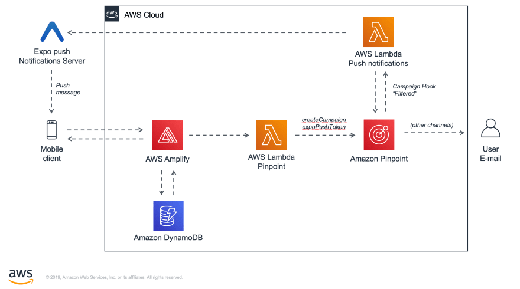

# expo-amplify-pushNotifications

This is an implementation of the following blog post by Ramon Postulart using functional components and expo-cli:
https://medium.com/abn-amro-developer/a-guide-to-implement-push-notifications-with-react-native-expo-and-aws-amplify-5b0b62456f39

The project has the following architecture

- This code has only been tested in Android with the Expo Go app.
- For the SDK you still need to do extra steps, see the following comment in the original blog post: https://dev.to/jackatdev/comment/nin4
